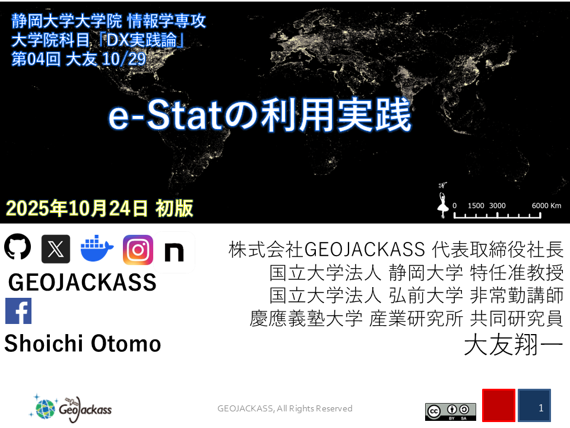

# 静岡大学大学院　情報学専攻 「DX実践論」2025


### 資料は下記URLからご覧ください
- (GithubPages) https://geojackass.github.io/shizuokauniv_dx_2025/
- (git clone) docs/index.htmlあるいはPDF資料を参照してください．

- 第4回はR，第5回はpythonとQGISを使用します．Dockerで環境を構築する場合は，pythonとRの必要ライブラリが使用可能となります．
- https://hub.docker.com/r/geojackass/orihime

orihime:sweet_melodyのbuildはDokcerfileを参照してください．上述の通りにdockerhubでhostされていますので，buildでもpullでも使用可能です．
```
docker pull geojackass/orihime:sweet_melody
```
次回，第5回講義ではpostgress及びPgRoutingを使用します．
Dockerfileをカスタマイズしても問題ありません．1つのコンテナを多機能に肥大化させる設計思想はあまり好きになれないですが，禁止はしません…
次回はcompose.ymlをカスタマイズして，orihimeと別コンテナでpostgresのコンテナを起動して使用します．  
- HW spec:4G or more(recommend 8G or more)

### Docker Compose USAGE

- 起動
```
docker compose up -d
```

- 停止
```
sudo docker compose stop
```

- 削除
```
sudo docker compose down
```

#### 起動書式
- 一口目「甘いメロディー」
```
sudo docker compose -f {filename}.yml up -d
```

License
=======
### Released under the BSD 3-Clause License
#####  Copyright (c) 2025 Shoichi Otomo [@geojackass](https://geojackass.com/)

Redistribution and use in source and binary forms, with or without modification, are permitted provided that the following conditions are met:

1. Redistributions of source code must retain the above copyright notice, this list of conditions and the following disclaimer.

2. Redistributions in binary form must reproduce the above copyright notice, this list of conditions and the following disclaimer in the documentation and/or other materials provided with the distribution.

3. Neither the name of the copyright holder nor the names of its contributors may be used to endorse or promote products derived from this software without specific prior written permission.

THIS SOFTWARE IS PROVIDED BY THE COPYRIGHT HOLDERS AND CONTRIBUTORS “AS IS” AND ANY EXPRESS OR IMPLIED WARRANTIES, INCLUDING, BUT NOT LIMITED TO, THE IMPLIED WARRANTIES OF MERCHANTABILITY AND FITNESS FOR A PARTICULAR PURPOSE ARE DISCLAIMED. IN NO EVENT SHALL THE COPYRIGHT HOLDER OR CONTRIBUTORS BE LIABLE FOR ANY DIRECT, INDIRECT, INCIDENTAL, SPECIAL, EXEMPLARY, OR CONSEQUENTIAL DAMAGES (INCLUDING, BUT NOT LIMITED TO, PROCUREMENT OF SUBSTITUTE GOODS OR SERVICES; LOSS OF USE, DATA, OR PROFITS; OR BUSINESS INTERRUPTION) HOWEVER CAUSED AND ON ANY THEORY OF LIABILITY, WHETHER IN CONTRACT, STRICT LIABILITY, OR TORT (INCLUDING NEGLIGENCE OR OTHERWISE) ARISING IN ANY WAY OUT OF THE USE OF THIS SOFTWARE, EVEN IF ADVISED OF THE POSSIBILITY OF SUCH DAMAGE.
